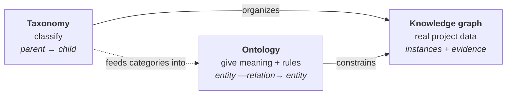
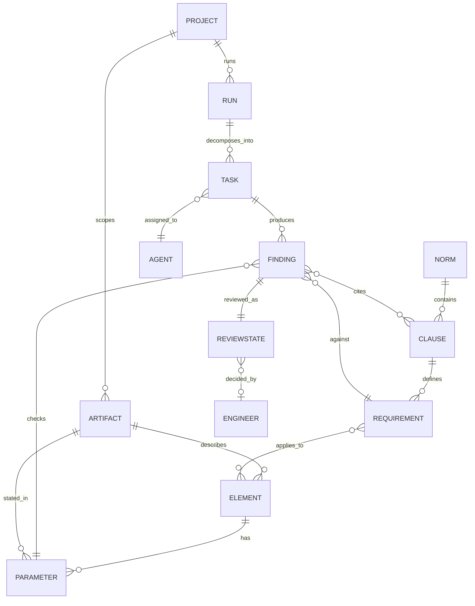
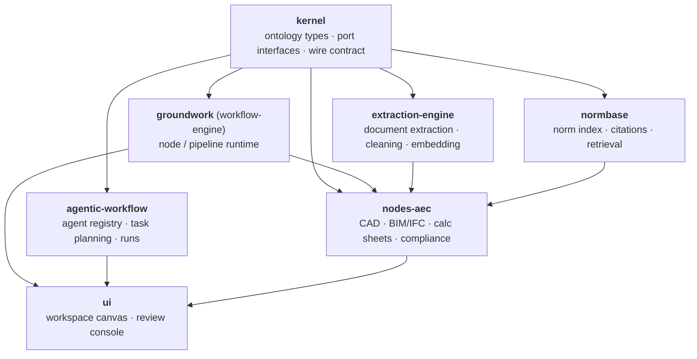

<p align="center">
  
</p>

<h1 align="center">Humanized — Foundation & Architecture</h1>

<p align="center">
  <sub>🧪 Status: <b>prototyping — draft v0.1</b> · Mission and story: <a href="profile/README.md">org profile</a></sub>
</p>

> [!NOTE]
> This is a **first draft**. We are still prototyping and brainstorming.
> Use cases, features, repository boundaries and the ontology below are
> working hypotheses, not commitments. We will refine and lock them in as
> real projects prove or disprove them.

---

## Our philosophy

### The AI drafts. The engineer decides.

We build **human-centered agentic AI**. Agents take on the repetitive,
cross-document work of engineering and planning. The professional stays in
charge of every decision that carries a signature.

Five principles guide every repo in this organization:

| # | Principle | What it means in practice |
| :-: | :--- | :--- |
| 1 | **Human keeps the pen** | No AI output is final. Every finding, draft or edit is a review item (`pending` → `verified` / `flagged`) until a named human decides. We never apply changes silently. |
| 2 | **Evidence, always** | Every output carries its sources: the drawing, the page, the norm clause. No citation means no finding. |
| 3 | **One connected model, not a pile of files** | CAD, calculation sheets, specifications and norms describe *one* project. We read them together as a graph so they cannot drift apart. |
| 4 | **Honest status** | A feature is *built*, *partial* or *coming soon*, and we say which. We never present a mockup as real. |
| 5 | **Modular by default** | Each capability is a standalone library or service with a clear contract. You can use one piece without adopting the whole stack. |

---

## Our foundation: taxonomy → ontology → knowledge graph

Our system is built on a shared understanding of the AEC domain. We follow the
three-layer model described in
[Neo4j — Taxonomy vs. Ontology vs. Knowledge Graph](https://neo4j.com/blog/knowledge-graph/taxonomy-vs-ontology-vs-knowledge-graph/):

> Taxonomies and ontologies are the **blueprint**. The knowledge graph is
> **what you build**.

| Layer | Question it answers | Structure | In Humanized |
| :--- | :--- | :--- | :--- |
| **Taxonomy** | *What kind of thing is this?* | A hierarchy of parent–child categories | How we classify disciplines, assets, documents, norms and project phases |
| **Ontology** | *What does it mean, and how does it relate?* | Entities, typed relationships and logical rules | The shared vocabulary and rules that every repo speaks (lives in `kernel`) |
| **Knowledge graph** | *What is true for this project, right now?* | Real instances connected by relationships | One graph per project: its drawings, parameters, norms, findings and reviews |



### 1. Taxonomy: how we classify the AEC world *(draft)*

Hierarchies only, no logic yet. These are consistent labels for tagging,
filtering and navigation.

```text
Discipline
├── Electrical
│   ├── Railway 50 Hz auxiliary power   ← where we started
│   ├── Traction power (16.7 Hz)
│   └── Grid / substation
├── Structural
├── HVAC
└── Fire protection

Artifact (source)
├── Drawing          (DWG, DXF, PDF plan)
├── Model            (IFC / BIM)
├── Calculation      (sheet, report)
├── Specification    (Leistungsverzeichnis, technical spec)
├── Correspondence   (authority comment, tender Q&A)
└── Submission       (authority form, Erläuterungsbericht)

Norm
├── Legal            (law, ordinance, e.g. AEG, EBO)
├── Standard         (EN, DIN, VDE, IEC)
└── Operator guideline (e.g. DB Ril)

Project phase        (HOAI Leistungsphasen 1–9)
```

> Candidates to align with, instead of inventing our own: **IFC** entity
> classes for physical elements, **Uniclass / OmniClass** for classification,
> **HOAI** for phases. *(Open question, see below.)*

### 2. Ontology: the shared meaning *(draft)*

The ontology adds typed relationships and **rules** on top of the taxonomy. It
has two halves.

**Domain ontology** describes the engineering world:

| Entity | Definition |
| :--- | :--- |
| **Project** | A scoped body of work: its sources, its phase and its deliverables. |
| **Artifact** | A source file (drawing, model, calculation, specification) that a Project is allowed to read. Access is explicit and revocable. |
| **Element** | A physical or logical thing in the built asset: a cable, a cabinet, a protection device, a room. |
| **Parameter** | A measurable value of an Element (a cross-section, a bending radius, a pulling force) *as stated in a specific Artifact*. |
| **Norm / Clause** | A rule from a standard or guideline, with its currency (`active` \| `deprecated` \| `unknown`) and what superseded it. |
| **Requirement** | A concrete, checkable constraint derived from a Clause (e.g. *bending radius ≥ 150 mm*). |

**Process ontology** describes how humans and agents work on it:

| Entity | Definition |
| :--- | :--- |
| **Agent** | A named AI capability with a declared **write scope**: `read_only` \| `proposes_only` \| `writes_text` \| `writes_cad`. We always show the blast radius. |
| **Run / Task** | A unit of work (deterministic pipeline step or agent task) and the run that sequences it. |
| **Finding** | One AI judgment: an expected vs. actual value, a citation and a confidence score. |
| **ReviewState** | The *one* human-decision vocabulary: `pending` \| `verified` \| `flagged`, plus a note and the reviewer. It applies to every AI output. |
| **Engineer** | The accountable human. Only an Engineer can verify, and only an Engineer signs. |



**Rules (the part a taxonomy cannot express):**

1. Every **Finding** cites at least one **Clause** and one source **Artifact**.
2. Every AI output has exactly one **ReviewState**. It starts as `pending`, and only an **Engineer** can move it.
3. A **Parameter** that appears in two Artifacts with different values is a
   **Finding** (a consistency issue), even if no norm is violated.
4. A Finding that cites a `deprecated` Clause is a **Finding** (template drift).
5. An **Agent** can never act outside its declared write scope.
6. Status has only two shapes. **Progress**
   (`not_started → active → done | failed`) describes a step. **Review**
   (`pending → verified | flagged`) describes a human judgment. We don't
   invent a third.

### 3. Knowledge graph: one per project

The knowledge graph is the ontology filled with a real project's data. For
example, the planned cable in drawing `A-102`, sheet 3, has a bending radius
of 90 mm. It is subject to a DB Ril requirement of ≥ 150 mm. That produces a
Finding, which is `pending` review by the responsible engineer.

Because everything is connected, questions that used to take days become
queries:

- *Which drawings still cite a superseded guideline?*
- *Where does the calculation sheet disagree with the drawing?*
- *What changes downstream if this cable cross-section changes?*
- *Which findings are still unreviewed before submission?*

---

## How we build: modular, standalone libraries

Each repo is a **standalone library or service with one purpose**. Each one is
usable on its own and connects to the others only through the shared `kernel`
contract.



| Repo | Purpose | Shape | Status |
| :--- | :--- | :--- | :--- |
| **`kernel`** | The ontology as code: entity types, port interfaces, the two status shapes, one wire contract (Python + TypeScript generated from one source). No business logic. | Library | 🧪 Carving out |
| **`groundwork`** | Engineer-in-the-loop workflow engine: node-based, self-hosted, extensible. Runs deterministic pipelines. | Library + service | 🟡 Prototype |
| **`agentic-workflow`** | LLM task decomposition and multi-agent runs, with review built in. | Library | 🟡 Prototype |
| **`extraction-engine`** | Domain-agnostic document extraction → cleaning → embedding. Usable outside AEC. | Library + service | 🟡 Prototype |
| **`nodes-aec`** | AEC domain nodes: CAD (DWG/DXF), BIM (IFC), calculation sheets, compliance checks, submission formats. | Library (plugins) | 🟡 CAD built · BIM/calc planned |
| **`normbase`** | Norm and standard index with citation-level traceability and currency tracking. | Library → service | 🟡 Prototype |
| **`ui`** | Workspace canvas and review console. Talks to everything through the wire contract only. | App | 🟡 Prototype |
| **`demo`** | One-command public demo on sanitized, real-world data. No credentials needed. | Compose stack | ⚪ Planned |

**Engineering rules shared by all repos:**

- **Ports before storage.** Persistence always goes through an interface. The
  default adapter is in-memory or local. Postgres, S3 or Neo4j are swapped-in
  adapters, never a rewrite.
- **One wire convention.** `snake_case`, defined once in `kernel`, never
  hand-mirrored.
- **Artifacts mirror their source.** Derived files live in a shadow tree for
  each stage (`raw/ → clean/ → …`) and are cache-checked, so we never redo
  expensive AI work.
- **Split only with a reason.** A module becomes its own repo when it needs
  its own release cadence or its own owners, not before.

---

## Where we are, and what we still need to decide

**First use case (proven on real data):** compliance and consistency checking
for 50 Hz auxiliary power planning in DACH railway infrastructure. We read
real DWG/DXF plans, extract parameters, check them against DB Ril / VDE rules
and flag template drift and physical violations before authority review.

**Candidate use cases to evaluate and prioritize:**

- [ ] Cross-document consistency: drawing ↔ calculation ↔ specification
- [ ] Norm currency watch: flag superseded clauses across a project
- [ ] Submission package drafting with full citations (e.g. Erläuterungsbericht)
- [ ] Tender analysis: requirement and eligibility extraction, HOAI scoping
- [ ] Change impact: what a single parameter change touches downstream
- [ ] Expansion beyond rail: structural, HVAC, fire protection, grid planning

**Open questions:**

- Which external standards do we adopt for the taxonomy (IFC, Uniclass,
  OmniClass, bSDD) instead of defining our own?
- Should the ontology be formal (OWL / SHACL) from day one, or start as a
  property-graph schema and formalize later?
- Should `normbase` be an importable library or a network service?
- How do we version `kernel` so that plugins in `nodes-aec` stay compatible?
- What is the minimum feature set for a first pilot with a planning office?

> Railway electrification is where we started. The same coordination problem
> exists in every regulated corner of AEC, and the same answer applies.

---

<p align="center">
  <sub>⚠️ Final validation and sign-off always remain with the certified engineer.</sub>
</p>
